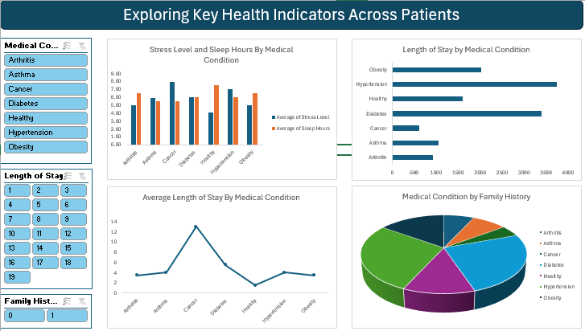
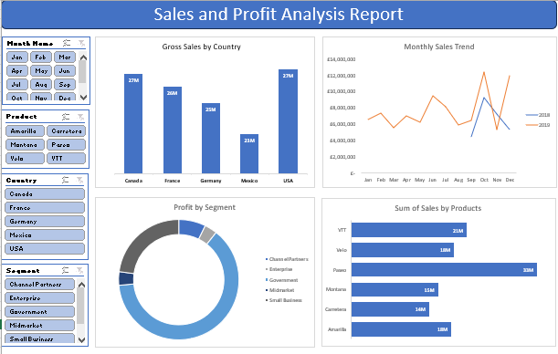
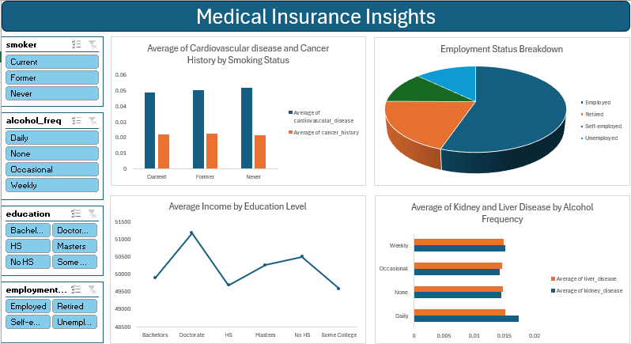
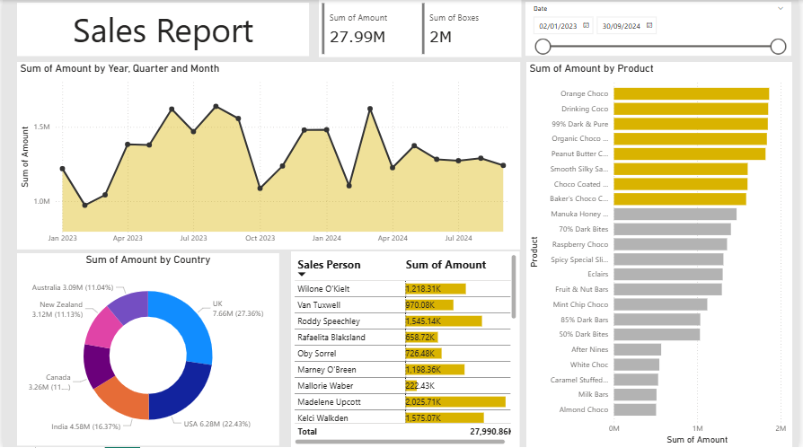
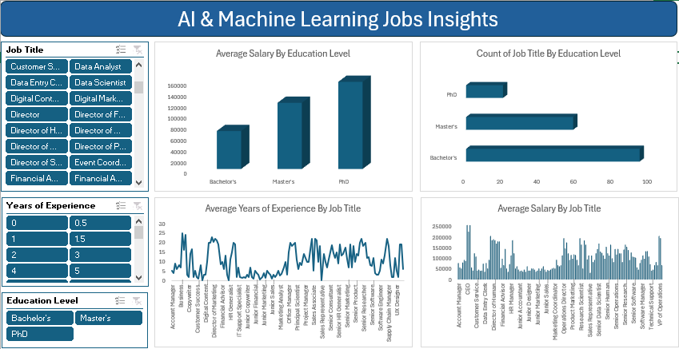

# Project 1

**Title:** [Exploring Key Health Indicators Across Patients](https://github.com/ZubeiruBukari/ZubeiruBukari.github.io/blob/main/Health%20Insight.xlsx)

**Tools Used:** Microsoft Excel (Data Cleaning and Formatting, Pivot Tables, Pivot Charts, Slicers,Conditional Formatting, Timelines)

**Project Description:** This project focuses on analyzing patient health data to uncover relationships between lifestyle factors, medical history, and hospital length of stay. Using Excel’s analytical and visualization features, the dashboard provides an interactive overview of key health indicators across various medical conditions such as Hypertension, Diabetes, Obesity, Cancer,Asthma, and Arthritis. The dashboard was designed to help healthcare analysts and decision-makers understand how factors such as stress, cholesterol, sleep duration, physical activity, and family history influence patient outcomes and hospitalization trends.

Dashboard Features:

Stress Level and Sleep Hours by Medical Condition: Bar chart comparing average stress and sleep hours across conditions.

Length of Stay by Medical Condition: Horizontal bar chart showing hospitalization duration by diagnosis.

Average Length of Stay by Medical Condition: Line chart illustrating variations in stay duration among different diseases.

Medical Condition by Family History: Pie chart highlighting the distribution of medical conditions based on family history presence.

Interactive Slicers: Filters to dynamically explore insights by medical condition, family history, and length of stay.

**Key findings:** Hypertension and Diabetes patients exhibited longer hospital stays compared to other conditions, indicating the chronic nature and management complexity of these diseases.

Higher stress levels were observed among patients with obesity and hypertension, suggesting a possible correlation between stress and lifestyle-related conditions.

Sleep duration varied significantly across medical conditions — patients with asthma and obesity tended to have fewer sleep hours on average.

Family history appeared to be a strong influencing factor for chronic conditions such as diabetes and hypertension.

The relationship between physical activity and stress suggested that active individuals tended to report lower stress levels.

**Dashboard Overview:** This dashboard serves as a powerful analytical tool for visualizing patient health trends. It combines clinical data analysis and visual storytelling to identify critical health patterns and risk factors. The interactive design allows users to:

Monitor hospital length of stay for different diseases.

Compare lifestyle factors such as stress, sleep, and physical activity across patient groups.

Explore hereditary influences through family history segmentation.

Overall, this dashboard provides actionable insights that could inform healthcare management strategies, patient education programs, and wellness interventions.

# Project 2

**Title:** Employee Data

**SQL Code:** [HR Database-SQL Codes](https://github.com/ZubeiruBukari/ZubeiruBukari.github.io/blob/main/Employee.SQL)

**SQL Skills Used:** Data Retrieval (SELECT): Queried and extracted specific information from the database.
Data Aggregation (SUM, COUNT): Calculated totals, such as sales and quantities, and counted records to analyze data trends.
Data Filtering (WHERE, BETWEEN, IN, AND): Applied filters to select relevant data, including filtering by ranges and lists.
Data Source Specification (FROM): Specified the tables used as data sources for retrieval

**Project Description:** This project demonstrates the design and analysis of an employee management system using SQL. The aim is to manage and analyze employee details and salary data through a relational database consisting of two tables — Employee_Details and Employee_Salary.

The Employee_Details table stores information such as employee ID, full name, manager ID, joining date, and city, while the Employee_Salary table contains data on project assignments, salary, and variable pay components.

Through a series of SQL queries, this project explores key HR and payroll insights, such as:

Identifying employees under a specific manager.

Fetching project distributions and participation counts.

Analyzing salary statistics (maximum, minimum, and average).

Filtering employees based on city, project type, and name patterns.

Performing calculations to derive total compensation per employee.

Combining data from multiple tables using JOIN operations to ensure integrated insights.

This project highlights how SQL can be used to effectively organize, query, and analyze workforce-related data, supporting informed decision-making in HR and business operations.

**Technology used:** SQL server

# Project 3

**Title:** Workplace Safety Data

**SQL Code:** [Workplace Database-SQL Codes](https://github.com/ZubeiruBukari/ZubeiruBukari.github.io/blob/main/Workplace_Safety.SQL)

**SQL Skills Used:** Data Selection and Filtering: Used SELECT, WHERE, and TOP to extract specific subsets of data.

Data Aggregation: Applied aggregate functions such as SUM(), COUNT(), and AVG() for cost and frequency analysis.

Grouping and Ordering: Used GROUP BY and ORDER BY to summarize and rank data.

Conditional Logic: Implemented CASE WHEN statements to convert numerical month data into month names.

Data Comparison: Used conditional filters such as >, BETWEEN, and LIKE for targeted queries.

Data Categorization: Segregated incidents by variables such as shift type, report type, and department.

Joins (conceptually): The dataset design can be extended to join with other HR or maintenance datasets for deeper insights.

**Project Description:** This project focuses on analyzing workplace safety incidents using SQL to extract meaningful insights from an organizational safety dataset named “Workplace Safety Data.” The primary objective of this project is to understand the patterns, costs, and frequency of safety incidents across different plants, departments, shifts, and demographic categories. This analysis helps management identify high-risk areas, evaluate incident trends, and design targeted safety interventions to minimize future occurrences.

The dataset contains key attributes such as Plant, Department, Incident Type, Report Type, Incident Cost, Days Lost, Age Group, Gender, Year, and Month. By leveraging SQL queries, several data-driven insights were derived to address business and safety-related questions.

Objectives of the Project:

To identify the distribution of workplace incidents across different plants, departments, and shifts.

To analyze the financial impact of incidents by calculating total and average incident costs.

To determine which incident types and departments have the highest risk factors.

To assess demographic trends such as gender and age group most affected by specific incident types.

To provide data-driven recommendations for improving safety practices.

1. Identified plants with the highest frequency of workplace incidents, helping target safety audits.

2. Departments with higher incident costs were flagged for financial and safety reviews.

3. Identified Incident Type with Highest Days Lost

4. Distribution of Incident Types by Shift

5. Revealed that specific shifts (e.g., Night shifts) had higher rates of certain incident types.

Average Incident Cost by Injury Location

6. Injury cost analysis helped identify which injury types were most expensive to manage.

7. The age group most vulnerable to workplace incidents was identified, enabling targeted training.

8. Plants with frequent “Lost Time” incidents were pinpointed for operational reviews.

9. Showed how total safety costs fluctuated annually, indicating improvement or deterioration in safety performance.

10. Helped detect seasonal trends where incident frequency peaked (e.g., higher in summer months).

**Technology used:** SQL server

# Project 4

**Title:** [Sales Data](https://github.com/ZubeiruBukari/ZubeiruBukari.github.io/blob/main/Sales%20data.xlsx)

**Tools Used:** Microsoft Excel (Data Cleaning and Formatting, Pivot Tables, Pivot Charts, Slicers,Conditional Formatting, Timelines)

**Project Description:** This project involved analyzing global sales data to evaluate the performance of different products, customer segments, and countries. The goal was to uncover insights into profitability, sales trends, and market performance across various regions and product categories. The dashboard created provides a comprehensive overview of key business metrics such as sales, profit, and gross sales distribution, allowing stakeholders to monitor performance efficiently and make data-driven decisions.

Dashboard Features:

Gross Sales by Country: Visualizes total gross sales across Canada, France, Germany, Mexico, and the USA.

Monthly Sales Trend: Displays month-by-month sales trends across years, highlighting seasonality and performance fluctuations.

Profit by Segment: Shows contribution to profit from different customer segments such as Government, Midmarket, Enterprise, Channel Partners, and Small Business.

Sum of Sales by Products: Compares total sales across product categories like Carretera, Paseo, VTT, Velo, Amarilla, and Montana.

Interactive Filters:

Month: Analyze sales and profit for specific months.

Country: Focus on regional performance.

Product: Explore product-specific insights.

Segment: Drill down into performance by market segment.

**Key findings:** Top Performing Regions: Canada and the USA recorded the highest gross sales, indicating strong market presence and customer engagement.

Sales Seasonality: Noticeable sales fluctuations throughout the year, with peaks during later months (Nov–Dec), suggesting seasonal demand trends.

Segment Profitability: The Government and Midmarket segments generated the largest portion of profits, highlighting stable and high-value clients.

Product Performance: The Paseo and VTT products emerged as the best-selling items, contributing significantly to overall revenue.

Market Opportunities: Lower sales in certain countries and segments indicate potential areas for targeted marketing and product optimization.

**Dashboard Overview:** The Sales and Profit Analysis Dashboard provides an intuitive and interactive platform for visualizing sales performance. By combining multiple pivot charts and slicers, it enables users to easily filter data and identify key trends in revenue and profitability across different dimensions. This dashboard serves as a valuable tool for decision-makers to track performance, assess market dynamics, and make informed strategic choices regarding product focus, regional investment, and customer segmentation.

# Project 5

**Title:** [Medical Insurance Insights](https://github.com/ZubeiruBukari/ZubeiruBukari.github.io/blob/main/Medical%20Insurance%20Insights.xlsx) 

**Tools Used:** Microsoft Excel (Data Cleaning and Formatting, Pivot Tables, Pivot Charts, Slicers,Conditional Formatting, Timelines)

**Project Description:** This project focuses on analyzing a medical insurance dataset to uncover insights about health conditions, income, and lifestyle factors such as smoking and alcohol consumption. The dashboard helps visualize relationships between demographic attributes, health history, and lifestyle habits, providing a comprehensive view of health and socioeconomic patterns among individuals.

The goal of this analysis is to assist healthcare analysts, policy makers, and insurance providers in understanding correlations that may influence health risks and insurance considerations.

Dashboard Features:

Average of Cardiovascular Disease and Cancer History by Smoking Status: Identifies how smoking habits relate to major health conditions.

Employment Status Breakdown: Displays the proportion of individuals across employment categories, offering socioeconomic context.

Average Income by Education Level: Highlights the impact of educational attainment on income levels.

Average of Kidney and Liver Disease by Alcohol Frequency: Analyzes the relationship between drinking habits and related diseases.

Interactive Filters (Slicers):

Smoker Status: View insights for current, former, or non-smokers.

Alcohol Frequency: Filter by daily, occasional, weekly, or no alcohol consumption.

Education Level: Explore how education correlates with health and income.

Employment Status: Analyze differences based on job category.

**Key findings:** Smoking and Disease Risk: Current and former smokers showed a higher average rate of cardiovascular disease compared to non-smokers.

Income and Education: Individuals with doctoral degrees had the highest average income, while those without a high school education had the lowest.

Alcohol Consumption and Health: Daily alcohol consumers displayed higher averages of liver and kidney diseases, indicating potential health risks associated with frequent drinking.

Employment Distribution: The majority of individuals were employed, but a notable portion were retired, suggesting a balanced demographic mix across age groups.

Lifestyle Impact: Both smoking and alcohol frequency appear to have measurable effects on chronic disease prevalence, providing useful insight for insurance risk assessments.

**Dashboard Overview:** The Medical Insurance Insights Dashboard provides an interactive and visual exploration of health, lifestyle, and socioeconomic data. By integrating pivot charts and dynamic slicers, the dashboard allows users to analyze correlations between lifestyle factors (such as smoking and drinking) and medical conditions, while also exploring income and employment patterns. This dashboard serves as a valuable resource to understanding how lifestyle and demographic factors influence health outcomes and economic well-being.

# Project 6

**Title:** [Global Chocolate Sales Performance Dashboard](https://github.com/ZubeiruBukari/ZubeiruBukari.github.io/blob/main/Dashboard1.pbix)

**Tools Used:** Microsoft Power BI (Line Chart, Donut Chart, Bar Chart, Table, Cards, Date Slicer)

**Project Description:** This project focuses on analyzing the global chocolate sales performance for the period between January 2023 and September 2024. The goal was to identify key trends in sales performance across different countries, products, and salespersons.

The dashboard provides an interactive view of sales metrics, enabling stakeholders to monitor business performance, compare results between regions, and identify high-performing products and sales agents.

Key features of the dashboard include:

Sales Trends Over Time: A line chart showing how sales amounts fluctuate monthly and quarterly.

Sales Distribution by Country: A donut chart highlighting how sales are spread across major markets including the USA, UK, India, and Canada.

Top Products by Revenue: A bar chart ranking chocolate products based on total sales.

Sales Performance by Salesperson: A table summarizing total sales per representative.

KPIs: Key performance indicators showing Total Sales (27.99M) and Total Boxes Sold (2M).

Interactive Date Filter: Allows users to adjust the analysis period dynamically.

**Key findings:** Top Markets: The USA (6.28M) and UK (7.66M) emerged as the highest-revenue countries, contributing over half of total global sales.

Leading Products: Orange Choco, Drinking Coco, and 99% Dark & Pure were the top three best-selling products, accounting for a large portion of total sales.

High-Performing Salespersons: Wilone O’Kielt and Van Tuxwell led sales performance, driving significant revenue contributions.

Seasonal Trends: Sales peaked during mid-year periods, suggesting possible seasonal demand increases around specific months.

Global Performance: The dashboard revealed balanced contributions from several key markets (India, Canada, and New Zealand) supporting consistent global growth.

**Dashboard Overview:** This dashboard provides a visually engaging and data-driven overview of company performance. Users can easily track sales by time, region, product, and salesperson using interactive visuals.

This dashboard supports data-driven decision-making by helping managers:

Identify high-revenue markets and products.

Evaluate sales team performance.

Recognize seasonal sales patterns for better inventory and marketing planning.

Adjust sales strategies across countries to optimize performance.

Overall, this dashboard acts as a strategic management tool to monitor business performance, uncover insights, and drive future sales strategies for the chocolate company.

# Project 7

**Title:** [AI & Machine Learning Jobs Insights Dashboard](https://github.com/ZubeiruBukari/ZubeiruBukari.github.io/blob/main/AI%20%26%20Machine%20Learning%20Jobs%20Insights.xlsx)

**Tools Used:** Microsoft Excel (Pivot Tables, Pivot Charts, Slicers, Bar Chart, Column Chart, Line Charts) 

**Project Description:** This project analyzes AI and Machine Learning job market data to uncover key insights into how education level, job role, and experience influence salary distribution.

The dashboard provides a comprehensive view of workforce trends in the AI & ML domain, helping both employers and professionals understand compensation patterns and career progression paths.

Key Features of the Dashboard Include:

Average Salary by Education Level: Displays how salaries vary between Bachelor’s, Master’s, and PhD holders.

Count of Job Titles by Education Level: Shows which education levels dominate in the AI/ML job market.

Average Years of Experience by Job Title: Highlights how experience varies across different AI and tech-related positions.

Average Salary by Job Title: Provides insight into which roles offer the highest salaries within the industry.

Interactive Filters: Enable users to explore the data dynamically by selecting specific job titles, years of experience, or education levels.

**Key findings:** Education and Salary Relationship:
Employees with PhDs earn significantly higher average salaries, often exceeding $160,000, compared to Master’s and Bachelor’s degree holders.

Dominant Education Level:
The majority of positions are held by professionals with Bachelor’s degrees, although Master’s degree holders are well-represented in mid-to-senior roles.

Experience Impact:
Higher years of experience correlate with higher salaries across most job titles, particularly for managerial and technical leadership roles.

Top Paying Roles:
Positions such as Chief Technology Officer, Research Director, Senior Data Scientist, and Director of Product Management stand out as the most lucrative roles.

Industry Trend Insight:
The AI & Machine Learning sector rewards advanced education and technical expertise, showing clear progression from entry-level analyst roles to senior managerial or research positions.

**Dashboard Overview:** The AI & Machine Learning Jobs Insights Dashboard presents an interactive and data-driven summary of salary and experience trends across job roles and education levels.

This tool helps users:

Identify how education impacts salary potential.

Understand experience distribution across different roles.

Compare compensation across AI, ML, and data-related job titles.

Make data-backed career or hiring decisions.

Overall, the dashboard serves as a valuable analytical resource for HR professionals, job seekers, and data analysts, offering actionable insights into the evolving AI & Machine Learning job landscape.

# Project 8

**Title:** [Employee Database Management and Analysis]

**SQL Code:** [Employee Database Management](https://github.com/ZubeiruBukari/ZubeiruBukari.github.io/blob/main/Employee%20Database%20Management%20and%20Analysis) 

**SQL Skills Used:** CREATE TABLE, INSERT INTO — Database schema design and data insertion

SELECT, WHERE, ORDER BY, GROUP BY, JOIN — Data retrieval and filtering

COUNT(), SUM(), AVG(), BETWEEN, LIKE — Data aggregation and condition filtering

String functions (LEFT(), UPPER(), CHARINDEX())

Date functions (GETDATE(), BETWEEN for DOB filtering)

Temporary table creation using SELECT INTO

Ranking and limiting results using TOP

**Project Description:** This project focuses on building and analyzing an employee management database using SQL. It demonstrates the creation of relational database tables, data insertion, and the use of SQL queries to perform both data retrieval and data manipulation tasks.

The database consists of two main tables:

Employee_Info — stores employee demographic and departmental details such as name, department, project, address, date of birth, and gender.

Employee_Position — stores job-related data including position, date of joining, and salary.

Through this project, I performed several SQL operations to gain insights into the workforce, employee demographics, and organizational structure. The goal was to strengthen my SQL data handling and querying skills while understanding how relational databases can support human resource management systems (HRMS).

Project Objectives

Design and create normalized tables with appropriate constraints and primary keys.

Insert and organize employee data efficiently.

Retrieve, manipulate, and aggregate employee data using advanced SQL queries.

Analyze employee demographics, salary distribution, and departmental composition.

Apply string, date, and aggregate functions to extract meaningful insights.

Key Analytical Queries and Insights
1. Retrieve Employee Names in Uppercase

Demonstrated string manipulation using the UPPER() function to standardize name formatting.

2. Count of Employees Working in the HR Department

Found that two employees belong to the HR department, providing insights into departmental size.

3. Retrieve the Current Date

Used SQL Server’s built-in function GETDATE() to extract and format the system date.

4. Extract the First Four Characters of Employee Last Names

Utilized the LEFT() function to derive initials or prefixes of surnames for indexing or abbreviation.

5. Extract City Names from the Address Field

Used CHARINDEX() to parse city names from addresses like “Hyderabad(HYD)” → “Hyderabad”.

6. Create a New Table Based on an Existing One

Showcased data replication using SELECT INTO for backup or table cloning purposes.

7. Find Employees with Salaries Between 50,000 and 100,000

Filtered employees within a specific pay range using the BETWEEN operator.

8. Retrieve Names Beginning with ‘S’

Queried employees with first names starting with “S”, showing pattern matching via LIKE.

9. Retrieve Top 3 Highest Salaries

Applied TOP and ORDER BY to rank and display the top three earners.

10. Concatenate First and Last Names into Full Name

Combined columns using string concatenation for user-friendly data output.

11. Group Employees by Gender Born Between 1970–1995

Grouped results by gender to understand workforce demographics across age ranges.

12. Sort Employee Records by Last Name (Descending)

Demonstrated ordered retrieval for alphabetic reporting.

13. Fetch Employees with Last Name Ending in ‘A’

Applied wildcards and underscores in the LIKE pattern for advanced filtering.

14. Exclude Specific Employees

Showcased the use of NOT IN to exclude certain records from results.

15. Retrieve Employees Living in Delhi

Used LIKE for partial string match to fetch records by location.

16. Retrieve All Employees Who Hold Managerial Positions

Filtered records where EmpPosition is “Manager”.

17. Department-wise Employee Count (Ascending)

Grouped employees by department and ranked them by count.

18. Retrieve Male Employees in HR Department

Combined multiple conditions with AND to filter data precisely.

19. Retrieve Employees Who Have Joining Dates Recorded

Used INNER JOIN to merge employee info with their joining details.

20. Retrieve Two Minimum and Maximum Salaries

Ranked and filtered salary data to find the top two and bottom two salary earners.

**Technology used:** SQL server
